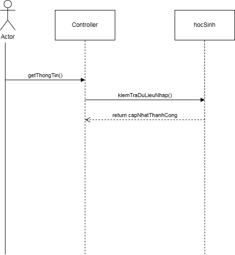
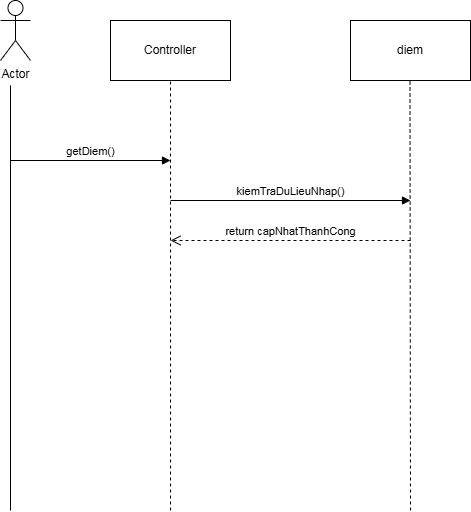
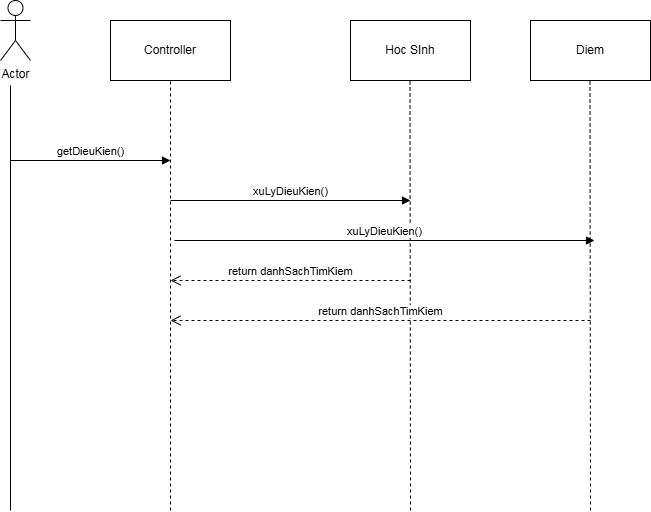
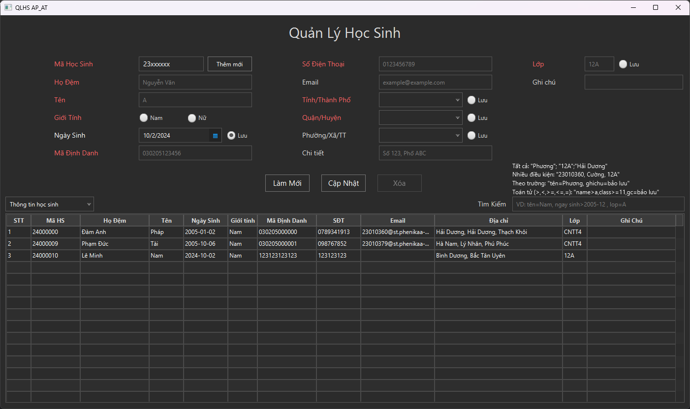
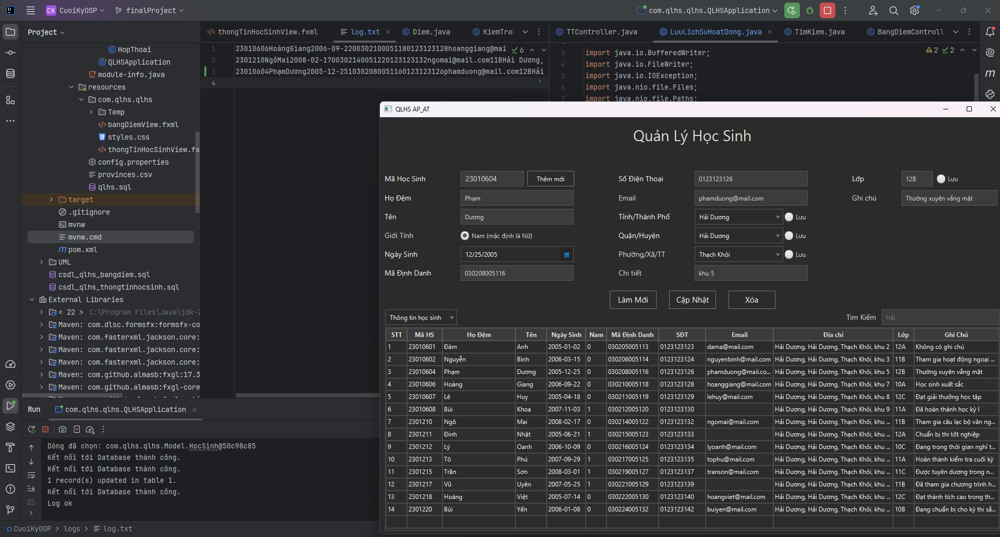
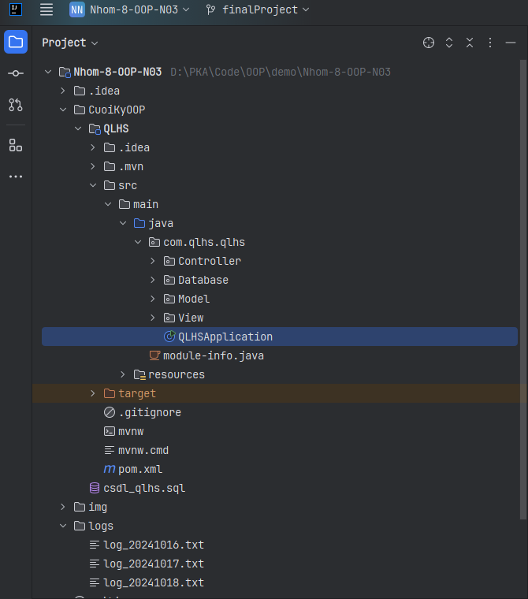

## Group08-OOP-N03

# Phần Mềm Quản Lý Học Sinh

## Giới thiệu
Phần mềm Quản Lý Học Sinh giúp quản lý thông tin học sinh một cách hiệu quả, bao gồm các chức năng như thêm, xóa, cập nhật và tìm kiếm học sinh. Phần mềm còn hỗ trợ việc lưu trữ và hiển thị danh sách học sinh theo các tiêu chí nhất định, giúp dễ dàng theo dõi tiến độ học tập và hoạt động của học sinh.
## Thành viên:
- Đàm Anh Pháp - MSV: 23010360 
- Phạm Đức Tài - MSV: 23010379

## Chức năng chính
- Thêm học sinh mới
- Cập nhật thông tin học sinh, bảng điểm.
- Tìm kiếm học sinh, bảng điểm.
- Hiển thị danh sách học sinh, bảng điểm.

## UML
### 1 UML Component Diagram
<br>
### 2 UML Sequence Diagram
#### 2.1 Cập nhật thông tin học sinh
#### <br>
#### 2.2 Cập nhật bảng điểm
<br>
#### 2.3 Tìm kiếm
<br>
## Giao diện người dùng
<br>
## I/O
<br>

# Demo


# Cách cài đặt, chạy dự án
- Sao chép mã nguồn bằng lệnh sau:
```bash
git clone https://github.com/anhphapdam2412/Nhom-8-OOP-N03.git
```
- Mở Folder 'Nhom-8-OOP-N03' bằng Intellij với cây thư mục như hỉnh ảnh.
- <br>