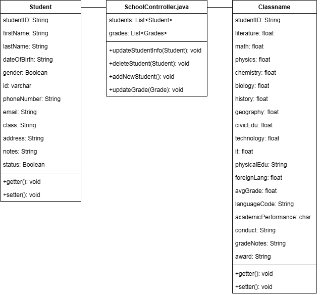

# Nhóm 8:
Thành viên:

1.Đàm Anh Pháp - MSV:23010360 

2.Phạm Đức Tài - MSV:23010379

# Final Project
Quản Lý Học Sinh

## Chức năng chính
  - Thêm học sinh mới
  - Cập nhật thông tin học sinh
  - Tìm kiếm học sinh theo tên, mã số, hoặc lớp
  - Hiển thị danh sách học sinh
## Cách sử dụng

### Thêm Học Sinh

Người dùng có thể thêm học sinh mới vào danh sách bằng cách nhập thông tin cần thiết như tên, lớp, địa chỉ,...

### Xóa Học Sinh

Người dùng có thể xóa học sinh khỏi danh sách bằng cách chọn học sinh cần xóa trong danh sách học sinh có sẵn.

### Cập Nhật Thông Tin Học Sinh

Cho phép người dùng cập nhật thông tin học sinh hiện có.

### Tìm Kiếm Học Sinh

Người dùng có thể tìm kiếm học sinh.

### UML

 

 

 

### Giao diện người dùng

### I/O

